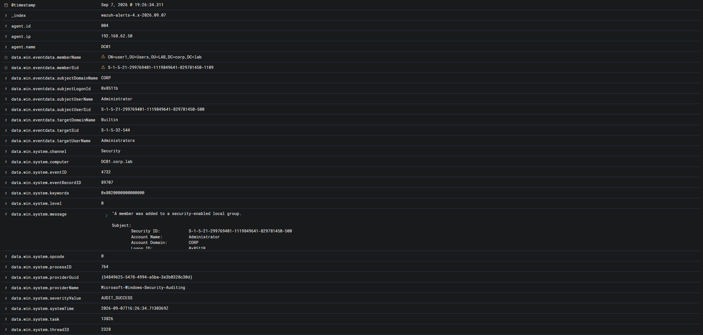
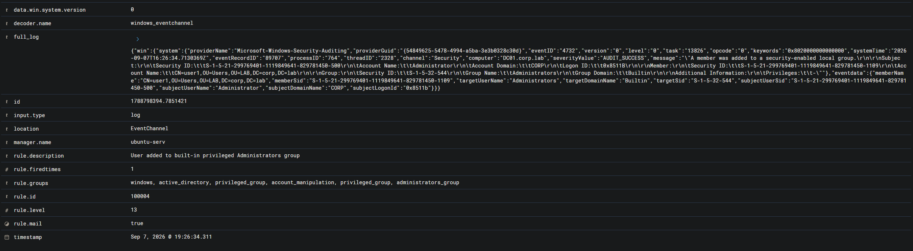

# Alert Triage — Добавление пользователя в привилегированную группу Administrators

## Идентификационные данные

| Параметр | Значение |
|---|---|
| Категория события | Изменение членства в привилегированной локальной группе |
| Система мониторинга | Wazuh SIEM |
| Идентификатор правила | 100004 |
| Описание правила | `User added to built-in privileged Administrators group` |
| Уровень критичности правила | 13 |
| Узел | `DC01` |
| FQDN узла | `DC01.corp.lab` |
| IP-адрес узла | `192.168.62.50` |
| Wazuh Agent ID | `004` |
| Операционная система | Windows Server / Domain Controller |
| Источник журнала | `Security` |
| Windows Event ID | `4732` |
| Декодер Wazuh | `windows_eventchannel` |
| Инициирующая учетная запись | `CORP\Administrator` |
| Добавленная учетная запись | `user1` |
| Целевая группа | `Builtin\Administrators` |
| Результат первичного анализа | False Positive |
| Решение | Плановое административное изменение, закрыть без эскалации |
| MITRE ATT&CK | T1098.007 - Account Manipulation: Additional Local or Domain Groups |
| Время события | `2026-09-07 16:26:34.311` |

---

## Сводка предупреждения

Wazuh сформировал предупреждение 13-го уровня после обнаружения добавления учетной записи `user1` в привилегированную встроенную локальную группу `Administrators` на узле `DC01`.

Событие было зарегистрировано журналом Windows Security как:

```text
A member was added to a security-enabled local group.
```

---




