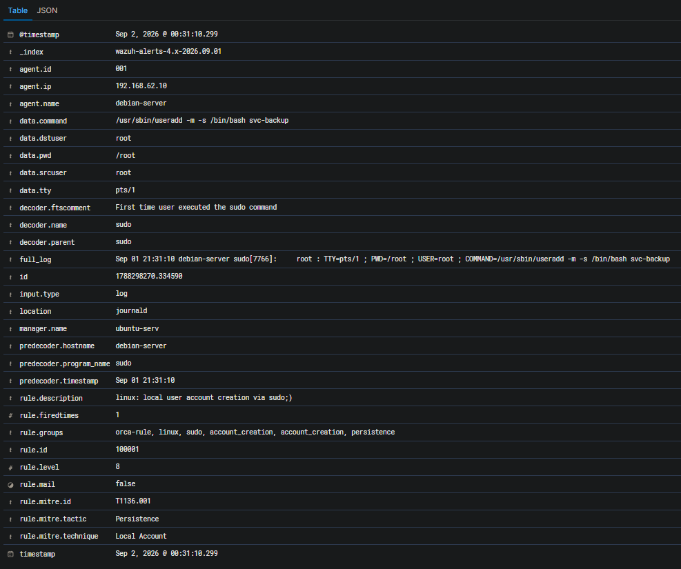

# Alert Triage — Создание локальной учетной записи пользователя с помощью sudo

## Идентификационные данные

| Параметр | Значение |
|---|---|
| Категория события | Создание локальной учетной записи |
| Система мониторинга | Wazuh SIEM |
| Идентификатор правила | 100001 |
| Уровень критичности правила | 8 |
| Узел | `debian-server` |
| IP-адрес узла | `192.168.62.10` |
| Wazuh Agent ID | `001` |
| Операционная система | Debian Linux |
| Инициирующая учетная запись | `root` |
| Контекст выполнения | `root` |
| Созданная учетная запись | `svc-backup` |
| Источник журнала | `journald` |
| Декодер Wazuh | `sudo` |
| Результат первичного анализа | True Positive |
| Решение | Передано на углубленное расследование |
| MITRE ATT&CK | T1136.001 - Create Account: Local Account |
| Время события | Sep 2, 2026 @ 00:31:10.299 |

---

## Сводка предупреждения

Wazuh выдал предупреждение 8-го уровня после обнаружения выполнения утилиты Linux `useradd` с правами root через `sudo` на хосте `debian-server`.

Обнаруженная команда была:

```text
/usr/sbin/useradd -m -s /bin/bash svc-backup
```

---


