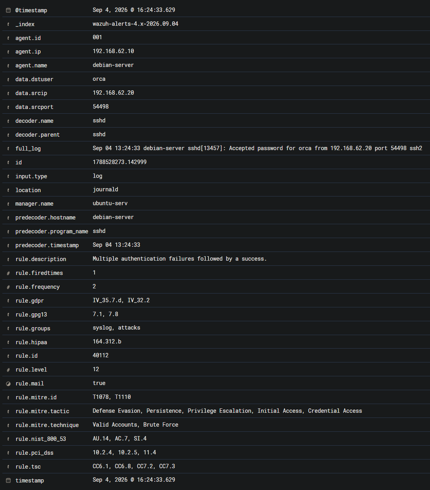

# Alert Triage — Множественные неуспешные SSH-аутентификации с последующим успешным входом

## Идентификационные данные

| Параметр | Значение |
|---|---|
| Категория события | Подозрительная SSH-аутентификация |
| Система мониторинга | Wazuh SIEM |
| Идентификатор правила | 40112 |
| Описание правила | Multiple authentication failures followed by a success |
| Уровень критичности правила | 12 |
| Узел | `debian-server` |
| IP-адрес узла | `192.168.62.10` |
| Wazuh Agent ID | `001` |
| Операционная система | Debian Linux |
| Сервис | `sshd` |
| Целевая учетная запись | `orca` |
| Исходный IP-адрес | `192.168.62.20` |
| Исходный порт | `54498` |
| Источник журнала | `journald` |
| Декодер Wazuh | `sshd` |
| Результат первичного анализа | True Positive |
| Решение | Передать на L2 для углубленного расследования |
| MITRE ATT&CK | T1110.001 - Brute Force: Password Guessing; T1078.001 - Valid Accounts: Default Accounts |
| Время события | Sep 4, 2026 @ 13:24:33.629 |

---

## Сводка предупреждения

Wazuh сформировал предупреждение 12-го уровня после обнаружения последовательности, состоящей из множественных неуспешных попыток аутентификации с последующим успешным SSH-входом.

Успешная аутентификация была выполнена для учетной записи:

```text
orca
```

---



