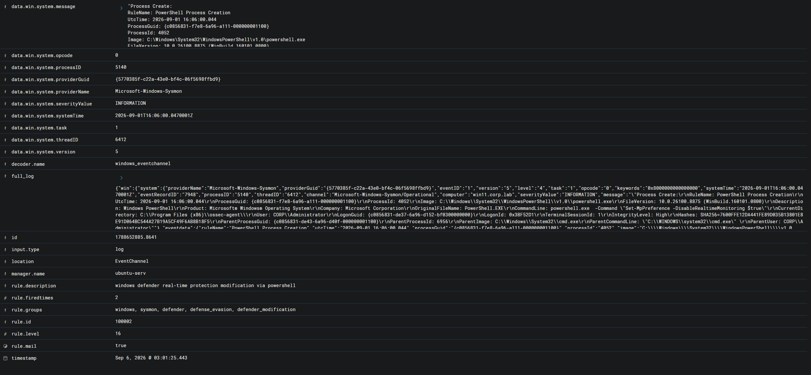

# Alert Triage — Отключение Windows Defender Real-Time Protection через PowerShell

## Идентификационные данные

| Параметр | Значение |
|---|---|
| Категория события | Изменение параметров Windows Defender |
| Система мониторинга | Wazuh SIEM |
| Идентификатор правила | 100002 |
| Описание правила | `windows defender real-time protection modification via powershell` |
| Уровень критичности правила | 16 |
| Узел | `win11` |
| FQDN узла | `win11.corp.lab` |
| IP-адрес узла | `192.168.62.40` |
| Wazuh Agent ID | `003` |
| Операционная система | Windows 11 |
| Источник телеметрии | Sysmon |
| Sysmon Event ID | 1 — Process Create |
| Канал журнала | `Microsoft-Windows-Sysmon/Operational` |
| Пользователь | `CORP\Administrator` |
| Процесс | `powershell.exe` |
| Уровень целостности | `High` |
| Родительский процесс | `C:\Windows\System32\cmd.exe` |
| Результат первичного анализа | False Positive |
| Решение | Плановое событие, закрыть без эскалации |
| MITRE ATT&CK | T1685 - Disable or Modify Tools |
| Время события | `2026-09-06 00:01:25.443` |

---

## Сводка предупреждения

Wazuh сформировал предупреждение 16-го уровня после обнаружения запуска Windows PowerShell с командой изменения параметров Microsoft Defender Real-Time Protection на узле `win11`.

Обнаруженная командная строка:

```text
powershell.exe -Command "Set-MpPreference -DisableRealtimeMonitoring $true"
```

---



