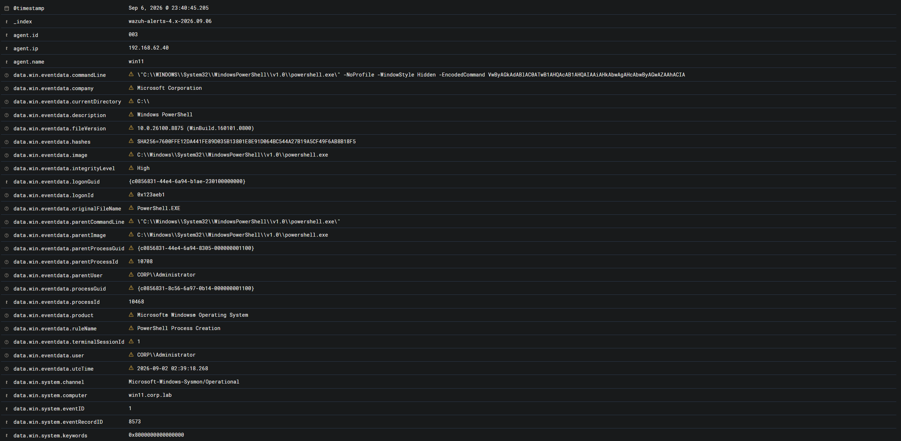
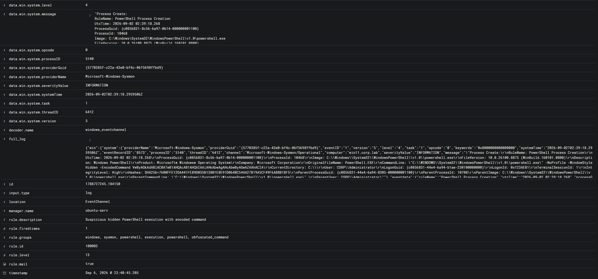

# Alert Triage — Подозрительный запуск PowerShell с закодированной командой

## Идентификационные данные

| Параметр | Значение |
|---|---|
| Категория события | Подозрительный запуск PowerShell с использованием EncodedCommand |
| Система мониторинга | Wazuh SIEM |
| Идентификатор правила | 100003 |
| Уровень критичности правила | 13 |
| Узел | `win11` |
| IP-адрес узла | `192.168.62.40` |
| Wazuh Agent ID | `003` |
| Операционная система | Windows 11 |
| Пользователь | `CORP\Administrator` |
| Процесс | `powershell.exe` |
| Родительский процесс | `powershell.exe` |
| Уровень привелегий | `High` |
| Источник журнала | `EventChannel` |
| Канал журнала | `Microsoft-Windows-Sysmon/Operational` |
| Sysmon Event ID | `1` |
| Результат первичного анализа | True Positive |
| Решение | Передать на L2 для углубленного расследования |
| MITRE ATT&CK | T1059.001 - Command and Scripting Interpreter: PowerShell; T1027.010 - Obfuscated Files or Information: Command Obfuscation |
| Время события | `2026-09-06 20:40:45.205` |

---

## Сводка предупреждения

Wazuh сформировал предупреждение 13-го уровня после обнаружения запуска Windows PowerShell с параметрами, указывающими на выполнение закодированной команды.

Обнаруженная командная строка:

```text
"C:\WINDOWS\System32\WindowsPowerShell\v1.0\powershell.exe" -NoProfile -WindowStyle Hidden -EncodedCommand VwByAGkAdABlAC0ATwB1AHQAcAB1AHQAIAAiAHkAbwAgAHcAbwByAGwAZAAhACIA
```

---



