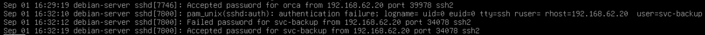
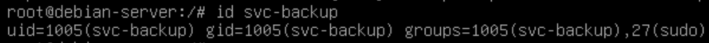
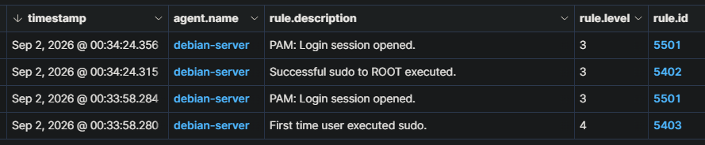
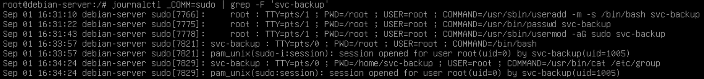
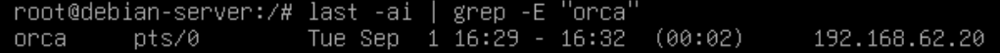
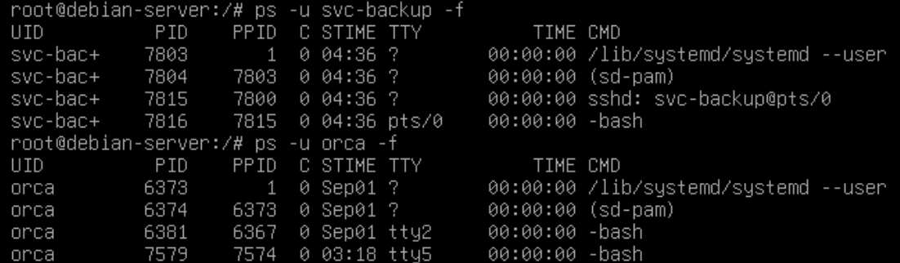

# SOC Incident Investigation: Create Account — Local Account

**Case ID:** `SOC-LAB-001`  
**Классификация:** `True Positive`  
**Узел:** `debian-server`  
**Система мониторинга:** Wazuh SIEM  
**Основная техника MITRE ATT&CK:** `T1136.001 - Create Account: Local Account`

> **Примечание:** формат временных меток UTC может различаться между отдельными системами и источниками журналов.

---

## Оглавление

- [1. Основание для проведения расследования](#1-основание-для-проведения-расследования)
- [2. Исходный alert](#2-исходный-alert)
- [3. Ход расследования](#3-ход-расследования)
  - [3.1. Анализ SSH-подключений](#31-анализ-ssh-подключений)
  - [3.2. Анализ привилегий учетной записи svc-backup](#32-анализ-привилегий-учетной-записи-svc-backup)
  - [3.3. Анализ использования sudo](#33-анализ-использования-sudo)
  - [3.4. Анализ конфигурации учетной записи](#34-анализ-конфигурации-учетной-записи)
  - [3.5. Анализ системной активности](#35-анализ-системной-активности)
  - [3.6. Анализ интерактивной сессии](#36-анализ-интерактивной-сессии)
  - [3.7. Анализ активных процессов](#37-анализ-активных-процессов)
- [4. Хронология событий](#4-хронология-событий)
- [5. Классификация действий по MITRE ATT&CK](#5-классификация-действий-по-mitre-attck)
- [6. Краткое резюме](#6-краткое-резюме)
- [7. Рекомендации](#7-рекомендации)

---

## 1. Основание для проведения расследования

Расследование инициировано после срабатывания пользовательского правила Wazuh `100001`, предназначенного для выявления создания локальных учетных записей Linux посредством выполнения `useradd` через `sudo`.

---

## 2. Исходный alert

| Параметр | Значение |
|---|---|
| **Категория события** | Создание локальной учетной записи |
| **Система мониторинга** | Wazuh SIEM |
| **Идентификатор правила** | `100001` |
| **Уровень критичности правила** | `8` |
| **Узел** | `debian-server` |
| **IP-адрес узла** | `192.168.62.10` |
| **Wazuh Agent ID** | `001` |
| **Операционная система** | Debian Linux |
| **Инициирующая учетная запись** | `root` |
| **Контекст выполнения** | `root` |
| **Созданная учетная запись** | `svc-backup` |
| **Источник журнала** | `journald` |
| **Декодер Wazuh** | `sudo` |
| **Результат первичного анализа** | **True Positive** |
| **Решение** | Передано на углубленное расследование |
| **MITRE ATT&CK** | `T1136.001 - Create Account: Local Account` |
| **Время события** | `Sep 2, 2026 @ 00:31:10.299` |

---

## 3. Ход расследования

### 3.1. Анализ SSH-подключений

Для анализа SSH-подключений с IP-адреса `192.168.62.20` использовалась следующая команда:

```bash
journalctl -u ssh | grep "192.168.62.20"
```



*Изображение 1 — Анализ SSH-подключений с IP-адреса `192.168.62.20`.*

В ходе анализа установлено, что ранее SSH-подключения с IP-адреса `192.168.62.20` на данном узле не фиксировались. Таким образом, данный адрес являлся новым и ранее неизвестным источником подключения.

С одного и того же IP-адреса `192.168.62.20` сначала был выполнен успешный SSH-вход под существующей учетной записью `orca`, а спустя несколько минут — попытка и последующий успешный вход под учетной записью `svc-backup`.

Наблюдаемая последовательность событий может указывать на создание дополнительной точки закрепления в системе.

---

### 3.2. Анализ привилегий учетной записи `svc-backup`



*Изображение 2 — Членство учетной записи `svc-backup` в локальных группах.*

В ходе проверки установлено, что учетная запись `svc-backup` состоит в группах:

- `svc-backup`;
- `sudo`.

Членство в группе `sudo` предоставляет учетной записи возможность выполнять команды с повышенными привилегиями.

---

### 3.3. Анализ использования `sudo`



*Изображение 3 — События Wazuh, связанные с использованием `sudo` учетной записью `svc-backup`.*

В событиях Wazuh установлено, что первое использование `sudo` учетной записью `svc-backup` произошло практически одновременно с ее первым подключением с IP-адреса `192.168.62.20`.

Это указывает на фактическое использование предоставленных учетной записи административных привилегий вскоре после удаленного входа.

---

### 3.4. Анализ конфигурации учетной записи



*Изображение 4 — Конфигурация учетной записи `svc-backup`.*

На основании собранных данных установлено, что учетная запись `svc-backup` не соответствует типичной минимально привилегированной сервисной учетной записи.

Для нее были настроены:

- интерактивная оболочка `/bin/bash`;
- пароль;
- членство в привилегированной группе `sudo`.

Впоследствии учетная запись была использована для успешной SSH-аутентификации на узле `debian-server`.

---

### 3.5. Анализ системной активности


*Изображение 5 — Чтение файла `/etc/group` учетной записью `svc-backup`.*

После успешного входа учетная запись `svc-backup` использовала системную команду `cat` для просмотра файла:

```bash
cat /etc/group
```

Данное действие позволило получить информацию о локальных группах системы.

---

### 3.6. Анализ интерактивной сессии



*Изображение 6 — Информация об интерактивной сессии `orca`.*

Интерактивная сессия была открыта приблизительно в `16:29` и завершена около `16:32`.

После завершения данной сессии, создание новых сессий не наблюдалось не наблюдалось.

---

### 3.7. Анализ активных процессов



*Изображение 7 — Активные процессы учетной записи `svc-backup`.*

На момент проверки активных процессов учетной записи `svc-backup` признаков запуска неизвестных или нетипичных процессов выявлено не было.

У пользователя `orca` все еще остаются 2 активных терминальных сессии/шелла `tty2` и `tty5`.

Были обнаружены стандартные процессы пользовательской и SSH-сессии:

- `systemd --user`;
- `sd-pam`;
- `sshd`;
- `bash`.

Наличие процесса:

```text
sshd: svc-backup@pts/0
```

подтверждает, что SSH-сессия учетной записи `svc-backup` на момент проверки оставалась активной и использует `pts/0`.

Дополнительных явно нетипичных процессов обнаружено не было.

---

## 4. Хронология событий

| Время | Событие | Источник | Значимость |
|---|---|---|---|
| `29:19` | Успешный SSH-вход `orca` с `192.168.62.20` | `sshd` | Первоначальный удаленный доступ |
| `31:10` | Создана учетная запись `svc-backup` | `sudo / Wazuh` | Создание локальной учетной записи |
| `31:22` | Для `svc-backup` установлен пароль | `sudo` | Настройка аутентификации |
| `31:43` | `svc-backup` добавлена в группу `sudo` | `sudo` | Предоставление административных привилегий |
| `32:10` | Ошибка аутентификации `svc-backup` с `192.168.62.20` | `sshd` | Попытка использования новой учетной записи |
| `32:12` | Неуспешный ввод пароля `svc-backup` | `sshd` | Неуспешная SSH-аутентификация |
| `32:19` | Успешный SSH-вход `svc-backup` с `192.168.62.20` | `sshd / lastlog` | Подтверждение удаленного использования |
| `33:57` | `svc-backup` запустила `/bin/bash` через `sudo` от `root` | `sudo` | Фактическое использование привилегий |
| `34:24` | `svc-backup` выполнила `/usr/bin/cat /etc/group` от `root` | `sudo` | Привилегированная системная активность |

---

## 5. Классификация действий по MITRE ATT&CK

| Technique ID | Technique |
|---|---|
| `T1021.004` | Remote Services: SSH |
| `T1078.003` | Valid Accounts: Local Accounts |
| `T1136.001` | Create Account: Local Account |
| `T1098.007` | Account Manipulation: Additional Local or Domain Groups |
| `T1548.003` | Abuse Elevation Control Mechanism: Sudo and Sudo Caching |
| `T1069.001` | Permission Groups Discovery: Local Groups |

---

## 6. Краткое резюме

На узле `debian-server` был зафиксирован успешный SSH-вход учетной записи `orca` с IP-адреса `192.168.62.20`.

Через непродолжительное время в привилегированной сессии была создана новая локальная учетная запись `svc-backup`. Для нее был создан домашний каталог, назначена интерактивная оболочка `/bin/bash`, установлен пароль, после чего учетная запись была добавлена в привилегированную группу `sudo`.

После создания учетной записи с того же IP-адреса `192.168.62.20` был выполнен успешный SSH-вход под `svc-backup`.

После успешного входа учетная запись `svc-backup` использовала `sudo` для получения привилегированного shell-контекста и последующего чтения файла `/etc/group`.

На момент дополнительной проверки SSH-сессия `svc-backup` оставалась активной. В списке процессов пользователя были обнаружены только стандартные процессы пользовательской и SSH-сессии; дополнительных явно нетипичных процессов выявлено не было.

---

## 7. Рекомендации

По результатам проведенного расследования рекомендуется выполнить следующие меры реагирования и дополнительной проверки:

1. **Заблокировать учетную запись `svc-backup` и IP-адрес `192.168.62.20`.**  
   Завершить все активные пользовательские сессии и процессы, связанные с учетной записью `svc-backup`.

2. **Отозвать административные привилегии учетной записи `svc-backup`.**  
   Удалить учетную запись из группы `sudo`. Если ее создание не является легитимным, после сохранения необходимых артефактов удалить учетную запись из системы.

3. **Сменить учетные данные `orca`.**  
   Выполнить смену пароля учетной записи `orca`, поскольку она использовалась для первоначального SSH-доступа с ранее не наблюдавшегося IP-адреса `192.168.62.20`.

4. **Проверить SSH-ключи.**  
   Проверить файлы `authorized_keys` учетных записей `orca`, `svc-backup` и других привилегированных пользователей на наличие неизвестных или несанкционированных SSH-ключей.

5. **Провести расширенный анализ активности `192.168.62.20`.**  
   Проверить связанные SSH-аутентификации, выполненные команды и другие сетевые соединения между данным IP-адресом и исследуемым узлом.

6. **Ограничить SSH-доступ к серверу.**  
   При наличии технической возможности разрешить административный SSH-доступ только с доверенных IP-адресов или из выделенного административного сегмента сети.

7. **Расширить мониторинг Wazuh.**  
   Настроить или проверить наличие правил обнаружения следующих событий:
   - создание новых локальных учетных записей;
   - добавление пользователей в группу `sudo`;
   - первый SSH-вход недавно созданных учетных записей;
   - SSH-подключения с ранее не наблюдавшихся IP-адресов;
   - выполнение `sudo` недавно созданными пользователями.

8. **Проверить синхронизацию системного времени.**  
   Убедиться, что все системы, участвующие в мониторинге и расследовании, используют корректно настроенную синхронизацию времени. Это необходимо для точной корреляции временных меток между Wazuh, Debian и другими источниками журналов.

---

### Итоговая классификация

> **True Positive**
> T1136.001 - Create Account: Local Account, Valid Accounts: Local Accounts - T1078.003

Наблюдаемая последовательность событий включает первоначальный SSH-доступ с нового IP-адреса, создание новой локальной учетной записи, предоставление ей административных привилегий, успешный удаленный вход под этой учетной записью и последующее использование `sudo`.

Совокупность установленных фактов указывает на потенциальное использование учетной записи `svc-backup` в качестве дополнительной точки закрепления в системе.
